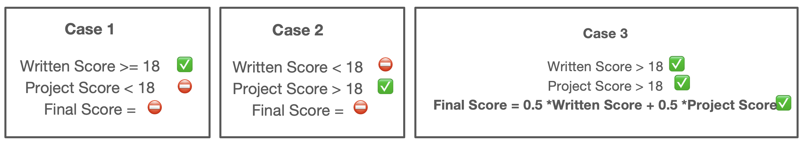
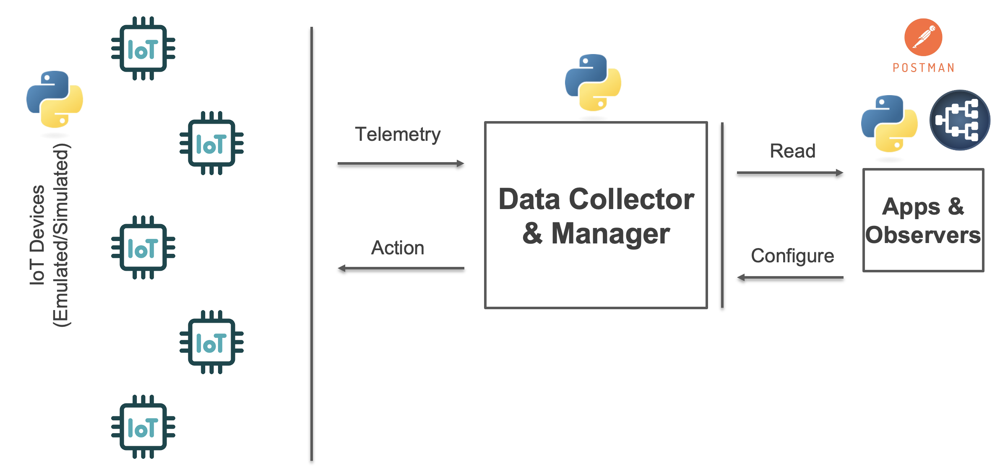
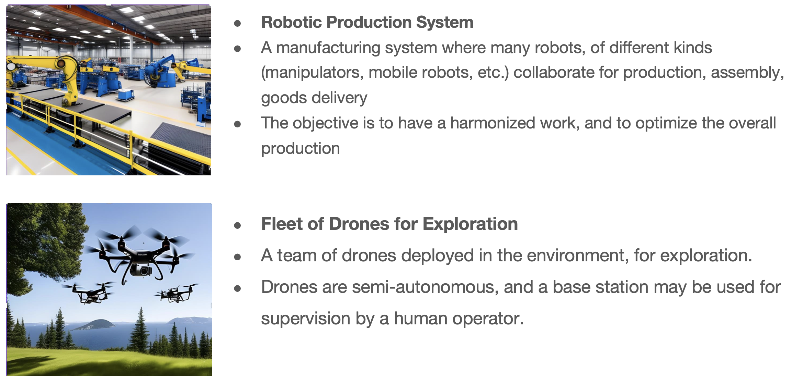
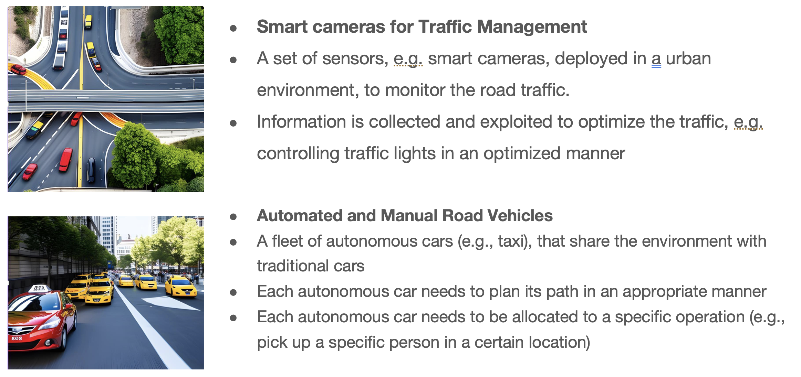
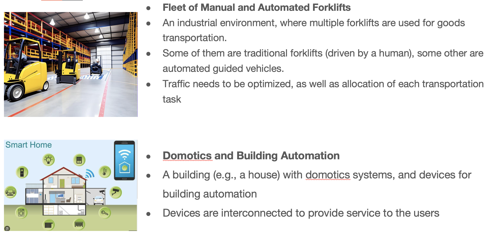
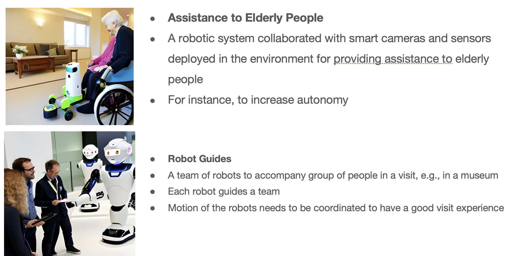
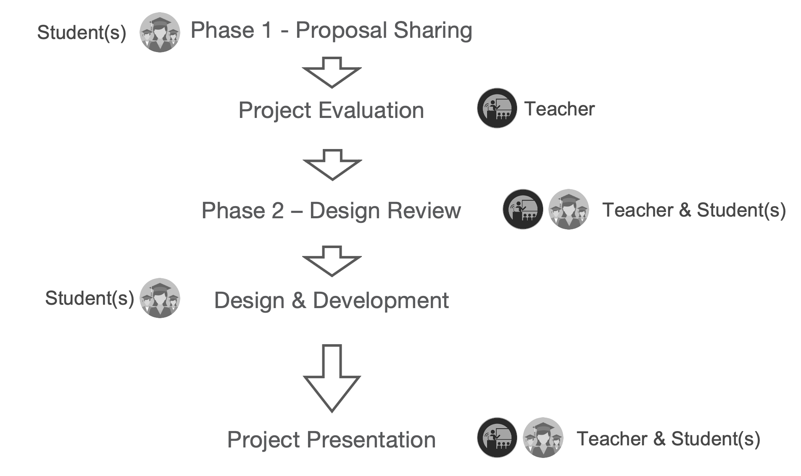
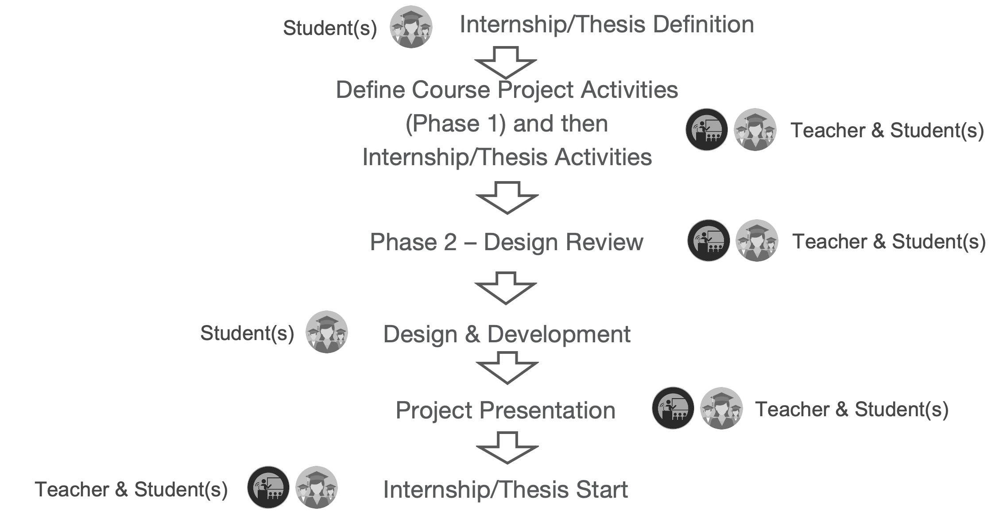

# 📝 Exam and Project Information

This document summarizes the written exam (structure, scoring, pass criteria) and the project (proposal preparation, architectural design, implementation, and review/presentation workflow).

**Project Proposal Files:**

- 🗂️ Project Template (Word): [Link](files/disa_project_proposal_template.docx)
- 🗂️ Device Example List (PDF): [Link](files/example_device_specs.pdf)

## 📊 Exam Structure and Scoring

### 🎯 Assessment Components

The exam consists of two components:

1. **📄 Written Exam** 
    - Approximately 4 questions covering theoretical and design topics discussed in class.  
    - Duration: 2 hours.  
    - Score range: 0–30.  
    - Pass condition: score ≥ 18.

2. **💻 Project**
    - Group work (up to 3/4 students).  
    - Design, development, report, and presentation based on a list of proposed topics.  
    - Score range: 0–30.  
    - Pass condition: score ≥ 18.

**🧮 Final Grade Calculation:**

Final grade = (written_score * 0.5) + (project_score * 0.5), only if both components are passed (each ≥ 18).  *Honours (30 cum laude) may be awarded for outstanding performance in both components.*

### 📝 Written Exam – Theory (No Coding) (2 Hours)

The written exam includes 4–5 questions selected from these types:

- Architectural Design  
- Smart Object & Software Design  
- Theory  
- Theory with Context / Application Scenario  

Multiple questions of the same type may appear, and not all types are guaranteed.

**📈 Scoring:**

- Each question has an assigned point value.
- Total maximum: 32 points (32 = 30 cum laude).
- Point distribution and included types vary by exam version.

Multiple versions of the exam may be issued in the same session (e.g., based on student ID, alphabetical grouping, or other criteria).

### 💼 Project Information

Projects are executed by groups of **up to three/four students**, who should:

1. Identify the application scenario (e.g., industrial, drones).
2. Select devices to model/emulate or prototype (e.g., presence sensors, cameras, switches) from the instructor list; define new ones if needed; or integrate existing physical assets/simulators.
3. Define the functional objectives (e.g., energy consumption calculation in a production line).
4. Submit scenario description for approval using the provided Word template (**Phase 1**).
5. Design and present the software architecture (protocols, data formats, component responsibilities) (**Phase 2**).
6. Develop the scenario and application.
7. Present the project at the oral exam with slides and a demo (**Phase 3**).

### 🎓 Final Exam Score

- Example 1-> Written Score 17 + Project Score 30 = ⛔️ (Written score < 18)
- Example 2 -> Written Score 23 + Project Score 15 = ⛔️ (Project Score < 18)
- Example 3 -> Written Score 25 + Project Score 30 = 27.5 -> 28  ✅
- Example 4 -> Written Score 30 + Project Score 30 = 30 ✅ ("Cum Laude" always and only assigned by the teacher in case of remarkable results written and/or project results)

### ❓ Frequently Asked Questions (FAQs)

- **Can I take the written exam and project presentation in two different sessions during the year?** Yes. They may be taken in separate sessions.

- **If I pass only one of the two components, does the other remain valid?** Yes. A passed component remains valid until the last exam session of the academic year (e.g., September or October/November for out‑of‑plan students).

- **Can I retake one component if I am not satisfied with the grade?** Yes. You may retake either component independently until the final grade is officially registered. For the project this means refining/correcting, not restarting from zero.

- **In a group project, can I present in a different exam session from my teammates?** Yes. You may present your part separately in another session.

- **In a group project, can I detach and change project/group?** Yes. One change is allowed. You then start a new project with new specifications, reusing prior work only if compatible.

- **If I attended the course in a previous academic year, what exam mode applies?** You may take the exam in the mode/content of the year you attended. On request you can opt for the latest mode and related content from the most recent lectures.

## 🚀 Project Definition

The **student** should prepare and submit a **project proposal** (including **topic** and **specifications**) via **email** following the required points (next sections). Proceeding to development is allowed only after **teacher approval**. Feedback may request **modifications** or **integrations**.  

Project approval is meant to properly balance the scope and complexity of the work with the available time and resources. Sometimes projects that are too ambitious or too simplistic and the approval process helps to adjust them accordingly.

> **Note:** Presentations are not permitted without explicit **authorization** and **confirmation** of the agreed **specifications**.

### 📋 Project Proposal – Phase 1

Students must submit a **Word document** (instructor template) containing:

- **List of Participants**: Name Surname, Email, Student ID
- **Project Title**
- **Shared with Distributed Control Systems?** (Yes/No)
- **Application Scenario Description** (e.g., industrial, smart home, drones)
- **IoT Smart Objects (Emulated)**: Description and functionality; sensors/actuators (e.g., presence sensor, alarm siren). An example list is provided to give you inspiration about potential devices and their functionalities.
- **Data Collector & Manager**: Description and functionality
- **Scope Clarification**: Specify **what** the project intends to achieve (goals, expected behavior), not **how** it will be implemented. The **how** (design, protocols, architecture, implementation details) is addressed in **Phase 2**

**Project Proposal Files:**

- 🗂️ Project Template (Word): [Link](files/disa_project_proposal_template.docx)
- 🗂️ Device Example List (PDF): [Link](files/example_device_specs.pdf)

> **Note:** In the project proposal, focus on clear, goal‑oriented specifications; avoid design or implementation details at this stage.

#### 🏗️ Project Structure

The above figure illustrates the main components and data flows of a typical IoT software architecture for the project. Those components and flows should be described in the proposal and implemented in the project.

Some additional details about each component and data flow are provided below.

**🔧 Components**

**- 📱 IoT Devices (emulated/simulated)**
    - Small programs that publish telemetry and accept commands/configuration; no physical hardware required.
    - Each device has a unique ID, type, and declared capabilities (sensors/actuators).

**- 🖥️ Data Collector & Manager (backend service)**
    - Central service that ingests telemetry, validates and stores state/history, evaluates rules, computes KPIs, and issues actions to devices.
    - Maintains the device registry and configuration.
    - Exposes northbound APIs for Apps/Observers and southbound interfaces for devices.

**- 👁️ Apps & Observers (clients)**
    - Tools and apps used to visualize data, test APIs, and configure behavior (e.g., Postman, MQTT Explorer, a simple Python dashboard, or a small web UI).
    - Read system state/metrics and change configuration via the Manager.

**🔄 Data Flows**

**- 📤 Telemetry (Device → Manager)**
    - Devices periodically or event‑driven publish measurements/events (include deviceId, timestamp, payload).

**- 📥 Actions/Downlink (Manager → Device)**
    - Manager sends control commands and configuration updates (e.g., setpoint, on/off, sampling rate), optionally with correlation IDs.

**- 🔍 Read/Query-Subscribe (Apps → Manager)**
    - Clients query current state, history, and KPIs or subscribe to updates/alerts.

**- ⚙️ Configure (Apps → Manager)**
    - Clients manage rules, thresholds, device registry, and parameters through the Manager.

**✅ Minimum demonstrable scenario**

- Emulated devices (the number depends on the target scenario and its complexity).
- One Data Collector & Manager service.
- One App/Observer that reads data and updates configuration.
- One closed loop where a rule in the Manager triggers an action back to a device.

#### 🎨 Additional Design Considerations

The project can be conducted individually or in groups of **up to three/four students**. 
The student(s) will need to:

- **🌍 Identify and Describe the Application Scenario**:
    - Examples include **Smart Home**, **Smart City**, **Industrial**, etc.

- **🔌 Select Devices to Model/Emulate**:
    - Choose from a list provided by the instructor (e.g., **presence sensors**, **cameras**, **switches**).
    - New devices can be defined if necessary.

- **🖥️ Emulation of Devices**:
 
    - All devices can be emulated as discussed in class.
    - To achieve the maximum grade, physical implementation using **Arduino** or other prototyping boards is **not required**.
    - If a student is interested in physically building one or more devices, this should be mentioned in the proposal as it will be considered a **plus**.

- **🎯 Define and Describe Envisioned Functionalities**:
    - Clearly outline the functionalities within the target scenario.

- **📊 Include a Data Collector & Manager Component**:
    - This independent component is responsible for:
        - Reading data from sensors.
        - Modifying the environment by interacting with actuators (e.g., calculating consumption within a **Smart Home**) according to the project goals and designed behaviors.

- **📱 Apps & Observers**:
    - Demonstrate that the project is operational.
    - Can include:
        - Custom code with simple examples.
        - Existing applications such as **PostMan**, **MQTT Explorer**, or an already existing simulator.

- **📬 Proposal Submission**:
    - The proposal should focus on high-level functionalities, target goals, and envisioned components.
    - Avoid implementation details at this stage (these will be addressed in **Phase 2**).
    - Submit the proposal to the teacher for approval using the **Word template** provided on **Moodle**.

### 🛠️ Project Implementation – Phase 2

The project should involve the following components:

- **🐍 Emulated Python IoT Smart Objects**:
    - **Quantity**: Specify the number of emulated smart objects.
    - **Functionalities**: Describe the functionalities each object is mapping.

- **🌐 Adopted Protocols & Data Format**:
    - **Protocols**: Identify the protocols used (e.g., **MQTT**, **HTTP**).
    - **Data Format**: Specify the data format (e.g., **JSON**).
    - **Communication**: Explain how applications and components communicate within the scenario.

- **🔗 Interaction of IoT Devices and Architectural Components**:
    - Describe how IoT devices and other architectural components interact and communicate.

- **🏛️ Software Architecture Pattern**:
    - Identify the architecture pattern used (e.g., **Monolithic Layered**, **Distributed Event-Driven**, **Microservices**).
    - **Justification**: Explain why this pattern was chosen.
    - Use as reference the **Laboratories on Software Architectures & Patterns** and related materials on the dedicated repositories and in particular focus on Microservices and Containerization labs for Software Architecture Patterns.

- **💾 Software Applications & Components**:
    - List the applications and components developed within the project.
    - Identify which will become **containers** and **microservices**, and provide reasoning.

- **🎬 Demo Applications/Components**:
    - Provide examples of applications/components that demonstrate the system's functionality.

- **📂 GitHub Repository Contents**:
    - **Team Participants**: List all team members.
    - **Project Code**: Include the complete project code.
    - **README**: Provide a README file with:
        - Project structure
        - Information about the project
        - Execution/run details
    - **Presentation Slides**: Prepare slides to illustrate:
        - Project idea
        - Context
        - Design approaches adopted
        - Target slide number: 5–10 slides

- **⏰ Submission Timeline**:
    - Ensure both the GitHub repository and presentation slides are ready for intermediate checks before the final presentation.

> **Note:** As reference example for Software Architecture Patterns see Laboratories and related materials on the dedicated repositories and in particular focus on Microservices and Containerization labs.

### 🔄 Project Shared with "Distributed Control systems" Class

**Shared Project Option (with "Distributed Control Systems")**

You may (optional) use **one common project topic** for:

- **Distributed and Internet of Things Software Architectures**
- **Distributed Control Systems** (Prof. Sabattini & Prof. Villani)

**🔑 Key Points**

- **Optional**: Sharing the topic is allowed, not required.
- **Separate Evaluation**: Each course assesses the project independently against its own requirements.
- **Mandatory Communication**: Send an email declaring the shared topic using the official **project template** (released during the dedicated Project Presentation Session).
- **Distinct Deliverables**: For each course, develop and document the specific required aspects (scope, design focus, artifacts).
- **Topic Flexibility**: Provided examples are illustrative only; custom topics are permitted.

**✅ Action Steps**

1. Select a topic (shared or course‑specific).
2. Fill the official template.
3. Email the template to the instructor to request approval.
4. Tailor documentation/deliverables per course requirements.

**Reminder**: Approval is required before proceeding. Example topics are not limiting; propose your own if justified.

#### 💡 Example Shared Topics

### 🎤 Project Presentation & Evaluation – Phase 3

**Evaluation focuses on:**

- **🎨 Design & Motivations**: Smart Object/resource modeling, protocol adoption, software and architectural choices.
- **💻 Code Quality**: Structure, modularity, clarity.
- **🎬 Project Demonstration**: Slides + live/system demo.
- **📂 GitHub Repository**: Complete code, clear README (project overview + run/execution instructions).

**Slides should:**

- Summarize: application context, involved devices, architecture overview, components, implementation choices.
- Exclude: source code snippets (focus on concepts and decisions).
- Target length: concise (5–10 slides recommended).

**Presentation format:**

- **⏱️ Duration (individual project)**: ~10–15 minutes.
- **❓ Questions**: Instructor may ask about design decisions, code, and system behavior.

**📅 Scheduling:**

- Presentations occur only on official exam dates or agreed shared schedules (no ad‑hoc appointments).

**👥 Group projects:**

- **Shared Design**: Common scenario and overall architecture.
- **Individual Contribution**: Each member develops and integrates a distinct component/module.
- **Presentation Flow**:
    - Common introduction (scenario + architecture): ~5 minutes.
    - Individual segments: each member presents their module (slides + code discussion): ~10 minutes per participant.
- Evaluation considers both collective coherence and individual ownership.

**Be prepared to explain:**

- Why selected protocols and data formats.
- Architectural pattern choice.
- Interaction flows among devices, services, and data manager.
- Testing and execution steps.

**✅ Repository checklist:**
- Team members listed.
- Clear directory structure.
- README with: goals, architecture diagram(s), components, run instructions.
- Demo scripts/configuration (if applicable).
- Presentation slides included.

**💡 Recommendation:** Use architecture diagrams (e.g., component, deployment, sequence) to quickly convey structure and behavior. Suggested tools: Draw.IO ([https://www.drawio.com/](https://www.drawio.com/)), and/or Mermaid graphs in Markdown files (you can also use the graphical tool[https://www.mermaidchart.com](https://www.mermaidchart.com)).

### 🤖 Generative AI Info & Disclaimer

📣 **Use of Generative AI (LLMs) – Allowed**  You are encouraged to use AI as a **support tool** to enhance learning, not to replace your own work.

👀 **Strategic Uses**

- **📚 Learning & Comprehension**
    - **Explain Code**: "Explain line by line what this Python function does."
    - **Improve Code Style**: "Refactor to be more readable and well-documented."
    - **Clarify Concepts**: "Difference between MQTT and AMQP?"
    - **Summarize Material**: "Summarize key points of this lesson on REST and HTTP."

- **🎯 Develop Skills**
    - **Critical Thinking**: "What are the limitations of this solution?"
    - **Alternative Implementations**: "Show three ways to implement a sorting algorithm."
    - **Optimization Brainstorming**: "Suggest strategies to improve performance."

- **🏋️ Preparation & Practice**
    - **Exercise Generation**: "Generate a similar programming exercise, slightly harder."
    - **Self‑Assessment**: "Create 5 multiple-choice questions on today's topics."
    - **Presentation Prep**: "Summarize the architecture choices for my slides."

✅ **Good Practices**

- **Verify Outputs**: Always review and test AI‑generated code or explanations.
- **Avoid Blind Copying**: Adapt and understand; do not submit unverified AI content.
- **Keep Ownership**: Design decisions and learning must remain yours.
- **Cite When Needed**: If AI contributes substantially to text or code rationale, acknowledge it.

❗️**Do Not Use AI For**

- Complete project implementation without understanding.
- Generating falsified results, data, or code you cannot explain.
- Bypassing required individual effort or group collaboration.

**Reminder**: AI augments learning; relying on it to "do" the work limits skill development.

#### ⚠️ Risks of Massive Delegation to AI

- **Loss of Real Learning**: Practical skills, reasoning, and retention do not develop if AI performs core tasks.
- **Dependence on AI**: Progressive inability to solve problems autonomously or in constrained environments.
- **Superficial Understanding**: Answers may look correct but lack depth; risk of memorization without true comprehension.
- **Errors & Hallucinations**: Potential for invented data, flawed code, or inaccurate technical explanations.
- **Reduced Critical Thinking**: Accepting outputs without analysis weakens evaluation and validation habits.
- **Weaker Problem-Solving Ability**: Limited exposure to challenging, non-standard scenarios impairs adaptability.
- **Diminished Ownership**: Design decisions and rationale may not be defendable during review or examination.
- **Ethical & Academic Integrity Issues**: Unverified or unacknowledged AI use can lead to misconduct concerns.
- **Skill Plateau**: Reliance blocks progression to intermediate/advanced competencies (debugging, optimization).
- **Misaligned Learning Goals**: Tool use may drift focus from course objectives if not consciously managed.

**🛡️ Mitigation Practices**

- **Use AI as a Guide, Not a Producer**: Start with your own draft, then refine.
- **Always Validate Outputs**: Test code, cross-check concepts, and reject low-quality suggestions.
- **Explain Before Accepting**: Paraphrase AI answers to ensure internalization.
- **Incremental Assistance**: Ask for hints or alternatives rather than full solutions.
- **Document AI Influence**: Track where AI shaped code or text for transparency.
- **Prefer Active Prompts**: Request comparisons, trade-offs, or edge cases to stimulate reasoning.

### 🔍 Project, Code Review & AI

The evaluation of code and projects does not require memorization, but rather **understanding and responsibility**. Each student must be able to:

- **Explain each portion of code**, what it does, which problem it solves, and with which approach.
- **Describe and justify the use of libraries and tools**.
- **Motivate the design choices and implemented solutions**.

> **NOTE** Even if the code works correctly, if the student is unable to explain it, **the exam will not be passed**. The goal: to develop **autonomy, responsibility, and mastery of one's own work**.

### 📊 Project Flow Summary

### 🎓 Project Flow & Internship/Thesis

